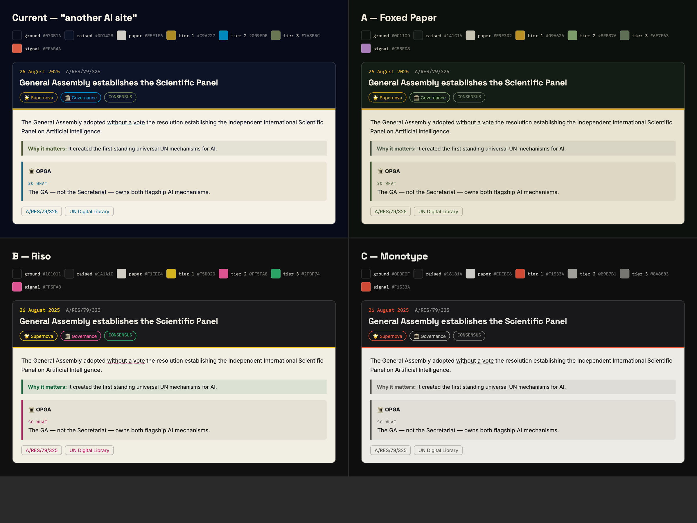

# DESIGN — getting out of the default AI look

**Status: DECIDED AND SHIPPED — Option B (Riso).** Mafi chose the vibrant direction and
dropped the UN blue outright rather than demoting it: the site is explicitly unofficial,
so borrowing the Organization's colour was never load-bearing. The §5 non-colour fixes
went in the same pass.

**Supersedes:** `UN_AI_TIMELINE_PLAN.md` §7 palette in full.



---

## 1. The diagnosis

You are right, and it is worth being precise about *why*, because the fix is not just "different colours".

The palette currently shipping is:

| Token | Value | |
|---|---|---|
| `--void` | `#070B1A` | deep navy |
| `--un-blue` | `#009EDB` | electric cyan-blue |
| `--assembly-gold` | `#C9A227` | amber |
| `--paper` | `#F5F1E6` | warm cream |
| `--signal` | `#FF6B4A` | coral |

**Deep navy + electric blue + coral + warm cream is the house style of roughly every AI product page shipped since 2023.** `#FF6B4A` in particular sits about six degrees of hue from Anthropic's own brand coral, and `#F5F1E6` is within a hair of the parchment cream used across Claude's surfaces. It was chosen for good institutional reasons — `#009EDB` is the official UN blue — but the *combination* reads as generic before anyone gets to the content.

Colour is only half of it. Four other things on the page carry the same fingerprint:

1. **Gradient-filled display text** (`.hero__title`, `background-clip: text`, pale→blue). This is the single most recognisable "AI landing page" move of the last three years.
2. **Glow shadows** on accents — `0 0 24px rgb(...)` on nodes and buttons.
3. **Glassmorphism** — `backdrop-filter: blur(12px)` on the sticky filter bar.
4. **Dark starfield with a cyan radial wash** behind everything.

A palette swap alone will improve things maybe 60%. §5 below deals with the other 40%, and costs almost nothing.

---

## 2. What stays fixed

Whatever we pick has to keep clearing the bars already met, because they were expensive:

- **WCAG AA on every text pairing.** All three options below are computed, not eyeballed — small text ≥ 4.5:1 on both the dark ground and both paper surfaces.
- **The paper reading surface.** Plan §7's best idea is that long-form text sits on paper, "documents, not terminals". Every option keeps a paper layer; only its temperature changes.
- **Three distinguishable tiers** (Supernova / Star / Stardust) plus one personality colour for A/BOT.
- **A dark ground** — the galaxy and the Big Bang need somewhere to happen.

---

## 3. The options

Contrast figures are computed with the WCAG 2.x formula against the exact surface each token is used on. Full audit: `scripts/palette-audit.py`.

### Option A — Foxed Paper *(was recommended; not taken)*

*Bottle-green black · foxed bone · brass · moss · plum*

A naturalist's field guide left in a drawer for forty years. The ground is black with a **green** undertone rather than blue, the paper is cooler and greyer than the current cream, and the accents are pigments rather than screen colours.

```css
--ground:        #0C110D;  /* bottle-green black */
--ground-raised: #141C16;
--ground-panel:  #1C271D;
--paper:         #E9E3D2;  /* foxed bone */
--paper-sunk:    #DED7C3;
--paper-ink:     #171C17;
--text:          #EFEADB;

--tier-1:        #D9A62A;  /* brass    — Supernova */
--tier-2:        #8FB37A;  /* moss     — Star      */
--tier-3:        #6E7F63;  /* sage     — Stardust  */
--signal:        #C58FD8;  /* plum     — A/BOT     */

/* on-paper variants, darkened to clear AA on bone */
--brass-on-paper: #6E5310;
--moss-on-paper:  #3F5A32;
--sage-on-paper:  #4A5544;
--plum-on-paper:  #6B3480;

--text-dim:   rgb(239 234 219 / 0.74);
--text-faint: rgb(239 234 219 / 0.56);
--ink-dim:    rgb(23 28 23 / 0.76);
--ink-faint:  rgb(23 28 23 / 0.67);   /* 0.67, not 0.62 — bone is darker than cream */
```

**Verified:** 30/30 pairings pass AA. Tightest is brass-on-paper-sunk at 5.03:1.

**Why it wins.** The Big Bang forms **olive branches** out of particles. On a green-and-brass palette that moment stops being a costume and becomes the logical conclusion of the whole colour system — the site has been quietly botanical the entire scroll. Plum for A/BOT is the one genuinely odd note, which is exactly right for a droid. And nothing about it says "technology company".

**Risk:** brass sits near the current gold. If you want a cleaner break, take B.

---

### Option B — Riso ✅ ADOPTED

*Ink black · newsprint · fluorescent pink · riso green · riso yellow*

Risograph printing: two or three saturated spot inks on cheap stock, slightly misregistered. Loud, printed, and about as far from an AI product page as it is possible to get while staying legible.

```css
--ground:        #101011;  /* neutral ink black */
--ground-raised: #1A1A1C;
--ground-panel:  #232326;
--paper:         #F1EEE4;  /* newsprint */
--paper-sunk:    #E5E1D4;
--paper-ink:     #141416;
--text:          #F1EEE4;

--tier-1:        #F5D020;  /* riso yellow — Supernova */
--tier-2:        #FF5FA8;  /* fluoro pink — Star      */
--tier-3:        #2FBF74;  /* riso green  — Stardust  */
--signal:        #FF5FA8;

--pink-on-paper:   #B01A63;
--green-on-paper:  #146B3F;
--yellow-on-paper: #6B5A05;
```

**Verified:** 25/25 pass AA, with unusually large margins (pink 5.70:1 on paper, yellow 12.61:1 on ground).

**Why it might win.** Instantly memorable, and it leans into "totally unofficial field guide" harder than anything else here. Fluorescent pink next to a document symbol is a good joke in itself.

**Risk.** This is the loud option. Fluorescent pink beside "lethal autonomous weapons systems" may be a tonal mismatch you do not want on a page attached to your professional profile. Worth seeing at full size before committing.

---

### Option C — Monotype

*Near-black · paper · one vermilion, and nothing else*

Hierarchy carried by **weight, size and rule** rather than hue. One accent, used sparingly. The most editorial and the most restrained.

```css
--ground:        #0E0E0F;
--ground-raised: #18181A;
--ground-panel:  #212124;
--paper:         #EDEBE6;
--paper-sunk:    #E1DED7;
--paper-ink:     #131315;
--text:          #EDEBE6;

--tier-1:        #F1533A;  /* vermilion — Supernova only */
--tier-2:        #B9B7B1;  /* light grey — Star          */
--tier-3:        #8A8883;  /* mid grey   — Stardust      */
--signal:        #F1533A;

--vermilion-on-paper: #B3301A;
--grey-on-paper:      #5A5854;
```

**Verified:** 23/23 pass AA.

**Why it might win.** Reads as a serious publication. Ages well. Makes the nine Supernovas genuinely land, because they are the only coloured things on the page.

**Risk.** Vermilion is still a warm red-orange — the closest of the three to the thing you are trying to get away from. And with only one accent, the constellation filter loses its colour coding and has to work by glyph alone.

---

## 4. What this costs

Two things you should decide knowingly rather than discover later.

**You lose the official UN blue.** `#009EDB` is not decoration — it is the UN's actual blue, and plan §7 chose it deliberately. Dropping it means the site no longer quotes the Organization's visual identity. Three ways to handle that:

- **Drop it entirely.** Cleanest break. The site is explicitly unofficial; borrowing less of the UN's identity is arguably more correct, not less.
- **Demote it to a citation colour** — UN blue used *only* on receipt links and document symbols, nowhere else. It becomes "this points at an official source", which is a more honest job for it than "accent".
- **Keep it and take Option A anyway.** Brass/moss/plum with UN blue reserved for links works, but you are back to a blue on the page and some of the distinctiveness goes with it.

My recommendation is the middle one. It keeps a real institutional signal and gives it a *meaning*.

**You lose the gold-emblem reference.** `--assembly-gold` came from the GA hall's emblem wall. Option A's brass is a near-relative and keeps the association; B and C drop it.

---

## 5. The other 40% — non-colour tells

Do these whichever palette you choose. They are cheap and they matter more than people expect.

| Tell | Where | Fix |
|---|---|---|
| **Gradient-filled display text** | `.hero__title`, `.zone--bang .zone__title` | Solid colour. If the headline needs interest, give it a rule above it or letterspacing, not a gradient. This is the single biggest one. |
| **Glow shadows** | `--glow-gold`, `--glow-blue` on nodes and A/BOT | Replace with a hard 1px ring or a tight offset shadow. Glow reads as "neon sci-fi"; a ring reads as "printed". |
| **Glassmorphism** | `backdrop-filter: blur(12px)` on `.filters` | Solid ground colour with a hairline rule underneath. |
| **Cyan radial wash** | `.sky` background gradients | Match the new ground family, and drop the opacity by about half. |
| **Perfectly even star-field** | `.sky__css` | Keep — it is cheap and it works. |

The galaxy shader also needs its three colour uniforms repointed (`uCool`, `uWarm`, `uPaper` in `src/scripts/galaxy.ts`). For Option A that is moss → brass → bone, which incidentally makes the olive-branch formation read far better than it does now.

---

## 6. Implementation

The architecture already supports this: every colour on the site resolves through `src/styles/tokens.css`, and Phase 3 deliberately kept derived surfaces as mixes of the base palette rather than hardcoded hexes. A swap is:

1. Replace the palette block in `src/styles/tokens.css`.
2. Repoint the three shader uniforms in `src/scripts/galaxy.ts`.
3. Apply §5's non-colour fixes.
4. Re-run the contrast audit and the axe sweep — both are scripted and take under a minute.
5. Regenerate the social card: `OG_ROOT=. node scripts/make-og.mjs`. It renders from the live tokens, so it follows automatically.

Roughly an hour, including re-verification. No content changes, no component rewrites.

---

## 7. What shipped

**Option B (Riso), UN blue dropped, §5 fixes applied.**

Notes from the implementation, for whoever touches this next:

- **The galaxy needed retuning, not just recolouring.** Riso inks are far more
  luminous than the navy palette the shader's brightness budget was written for. A
  straight colour swap left a pink nebula sitting on top of the reading cards. The
  settled-galaxy alpha came down from 0.46 to 0.24 and the canvas ceiling from 0.78
  to 0.6.
- **The olive branches are green now**, which is what made the whole decision worth
  it. `uWarm` — the emblem and detonation colour — is riso green, so the wreath that
  forms at the Big Bang reads as olive rather than as generic light.
- **One new contrast failure surfaced**: `.chip__count` was using `opacity: 0.6`
  compounded on already-dimmed text, which landed at 4.0:1 on the darker ground. Now
  an explicit `--ink-faint`. Opacity-on-dimmed-colour is a trap worth remembering.
- **Verified after the swap**: 108 palette pairings clear AA, axe-core reports zero
  violations across all eight states, Lighthouse unchanged at 97 mobile / 100 desktop
  with LCP 2.1s and 0.5s.

Option A remains fully specified above if the pink ever proves too loud in practice —
it is a token swap plus three shader constants.
